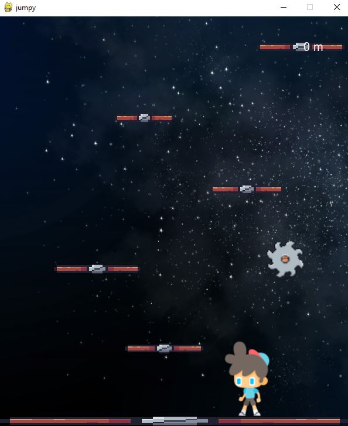
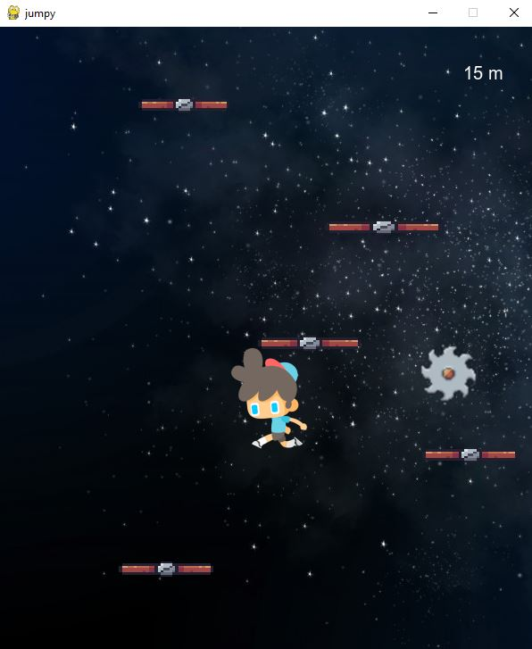
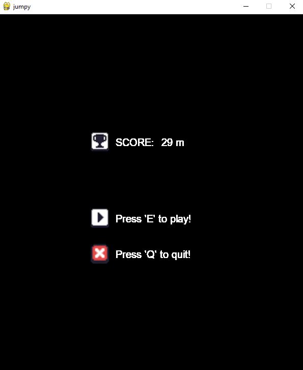

# Projekt-Pygame
Projekt na zaliczenie przedmiotu "Programowanie obiektowe 2" z wykorzystaniem biblioteki Pygame. 
Gra posiada proste menu wyposażone w przycisk Play oraz Exit. W prawym górnym rogu zliczana jest wysokość na jaką udało się wskoczyć graczowi. Dodatkowym utrudnieniem jest pojawiająca się piła, która 
losowo przelatuje z prawej i lewej strony. Zetknięcie się z nią skutkuje zakończeniem gry i przejściem do menu. Platformy są generowane o różnych losowych odstępach od siebie i posaidają różną szerokość. Całej rozgrywce towarzyszy melodia w tle oraz efekty dzwiękowe (skok bohatera, odgłos GameOver).

Mała galeria: 
 
 
 
